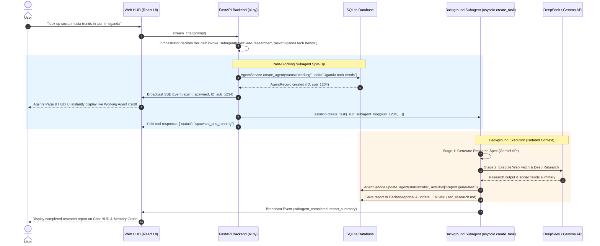

# Master Implementation Plan: Agency JARVIS OS (Node.js / Windows)

This document details the architectural synthesis, **Agent File Execution**, and **Non-Blocking Subagent Spin-Up Architecture** to fix Nathan's base **`jarvis`** template and build a high-performance **Digital Marketing Agency JARVIS OS** on **Node.js / Windows**.

---

## 🎯 Scope & Core Architecture

1. **Base Framework**: Nathan's `jarvis` repository ([E:/nate/JARVIS/jarvis](file:///E:/nate/JARVIS/jarvis)) — Cyberpunk React 19 + TypeScript + Vite Web HUD, D3 timelines, Neural Memory Graph, FastAPI/Node backend, Antigravity 2.0 Agentic Engine spec ([antigravity-clone-spec.md](file:///E:/nate/JARVIS/jarvis/antigravity-clone-spec.md)), Google Jules PR Developer Agent, Gemini CEO Spec generator, OpenRouter DeepSeek research subagent, and local Ollama (`qwen2.5-coder`) HTTP bridge.
2. **Platform Target**: **Node.js (v20+) & Python (3.11+) running natively on Windows**. Zero macOS AppleScript dependencies.
3. **No Discord**: All operations run through Nathan's Web Desktop HUD UI (with optional push webhooks).
4. **Target Domain**: **Digital Marketing Agency OS** (Lead generation, technical SEO audits, PPC/Social ad copywriting, campaign management, client reporting, and site development).

---

## 🚨 Root Cause Diagnosis: Why Subagent Spawning Failed in Base `jarvis`

In Nathan's original `backend/src/services/ai.py` ([ai.py](file:///E:/nate/JARVIS/jarvis/backend/src/services/ai.py#L445-L545)), subagent spawning (`_tool_delegate_task`) was implemented as a **blocking synchronous turn-loop inside the parent tool handler**:

```
[User Prompt: "look up social media trends in tech in uganda"]
       │
       ▼
[AIService.stream_chat] (Parent Orchestrator)
       │
       ▼ Calls tool: delegate_task(...)
       │
       ├──> [BLOCKING LOOP]: Runs 5 turns synchronously inside tool execution handler
       │    ├── Blocks parent stream chunk output
       │    ├── Database connection / transaction lock contention
       │    ├── Fails to emit real-time WebSocket / SSE state updates
       │    └── Times out or catches exception silently without updating AgentsView UI
       │
       ▼
[Result]: User sees no new agent on the Agents Page, and task fails or hangs!
```

### The Fix: Non-Blocking Concurrent Subagent Engine (Antigravity 2.0 Spec)
Per [antigravity-clone-spec.md](file:///E:/nate/JARVIS/jarvis/antigravity-clone-spec.md#L155-L194):
- Subagent invocation MUST BE **non-blocking** (`asyncio.create_task`).
- The child subagent starts with a **clean slate** (`messages: []`), eliminating prompt bloat.
- The parent tool handler returns an instant confirmation (`{"success": true, "subagent_id": "...", "status": "spawned_and_running"}`) and immediately yields control back to the UI.
- The child loop runs independently in the background, updating SQLite DB state & broadcasting real-time SSE events so the `AgentsView` **instantly renders the live subagent card**.

---

## 🔄 End-to-End Subagent Spin-Up Sequence



---

## 🔬 Subagent Execution & Safety Layer Details

1. **Git Pre-Execution Snapshot & Instant Rollback** *(from Ramsbaby)*:
   - Automatic git commit snapshot (`snapshot: jarvis-agent task_id`) before file modifications. Instant rollback on agent error.
2. **Pre-Check Completion Gate (`completionCheck`)** *(from Ramsbaby)*:
   - Evaluates fast completion scripts prior to calling LLMs for queued tasks, skipping unnecessary API calls.
3. **Patch-Only Diff Mode (`patchOnly`)** *(from Ramsbaby)*:
   - Saves landing page and code changes as `.patch` diff files for human review before applying.
4. **Verification Gate & Audit Feedback Loop** *(from Ramsbaby `verify-gate.sh`)*:
   - Independent Auditor subagent validates output before marking task completed. Injects audit feedback into retry loops if failed.
5. **Cross-Platform Action Tag Executor** *(from ethanplusai `actions.py`)*:
   - Handles `[ACTION:SCRAPE_LEADS]`, `[ACTION:SEO_AUDIT]`, `[ACTION:GENERATE_REPORT]`, `[ACTION:BUILD_PAGE]`.

---

## 🏛️ Updated Component Architecture

### 1. Web HUD & 3D Particle Orb Component
- `[NEW]` [src/components/ThreeOrbView.tsx](file:///E:/nate/JARVIS/jarvis/src/components/ThreeOrbView.tsx) — Three.js 3D Particle Orb canvas.
- `[MODIFY]` [src/App.tsx](file:///E:/nate/JARVIS/jarvis/src/App.tsx) — 3D Orb header mounting + voice reactivity.
- `[MODIFY]` [src/components/HUDView.tsx](file:///E:/nate/JARVIS/jarvis/src/components/HUDView.tsx) — Agency KPI dashboard & active campaign cards.

### 2. Antigravity 2.0 Non-Blocking Subagent Engine
- `[MODIFY]` [backend/src/services/ai.py](file:///E:/nate/JARVIS/jarvis/backend/src/services/ai.py) — Refactor `_tool_delegate_task` to non-blocking `asyncio.create_task` pattern with isolated context (`messages: []`).
- `[NEW]` [backend/src/services/planner_classifier.py](file:///E:/nate/JARVIS/jarvis/backend/src/services/planner_classifier.py) — Request complexity classifier.
- `[NEW]` [.agents/agents/seo-specialist.md](file:///E:/nate/JARVIS/jarvis/.agents/agents/seo-specialist.md), `ad-copywriter.md`, `lead-researcher.md`, `client-auditor.md`, `jules-developer.md` — Agency subagent definitions.
- `[NEW]` [backend/src/services/board_meeting.py](file:///E:/nate/JARVIS/jarvis/backend/src/services/board_meeting.py) — Daily Agency Board Meeting AI review system.

### 3. Agent Execution & Safety Engine Component
- `[NEW]` [backend/src/services/execution_safety.py](file:///E:/nate/JARVIS/jarvis/backend/src/services/execution_safety.py) — Git Snapshots, Rollback, `completionCheck`, and `patchOnly` diffs.
- `[NEW]` [backend/src/services/verification_gate.py](file:///E:/nate/JARVIS/jarvis/backend/src/services/verification_gate.py) — Verification Auditor & Retry Feedback Loop.
- `[NEW]` [backend/src/services/actions_exec.py](file:///E:/nate/JARVIS/jarvis/backend/src/services/actions_exec.py) — Action Tag executor (`[ACTION:SCRAPE_LEADS]`, etc.).
- `[NEW]` [backend/src/services/agency_queue.py](file:///E:/nate/JARVIS/jarvis/backend/src/services/agency_queue.py) — Background task store for autonomous execution.

### 4. 3-Tier Compounding Agency Memory Component
- `[NEW]` [backend/src/services/wiki_engine.py](file:///E:/nate/JARVIS/jarvis/backend/src/services/wiki_engine.py) — Stateful LLM Wiki (`clients.md`, `campaigns.md`, `agency_playbook.md`, `leads.md`, `seo_research.md`).
- `[NEW]` [backend/src/services/importance_gate.py](file:///E:/nate/JARVIS/jarvis/backend/src/services/importance_gate.py) — Mem0 pattern score filter ($\ge 3$ stored).
- `[MODIFY]` [src/components/MemoryView.tsx](file:///E:/nate/JARVIS/jarvis/src/components/MemoryView.tsx) & [NeuralNetworkGraph.tsx](file:///E:/nate/JARVIS/jarvis/src/components/NeuralNetworkGraph.tsx) — Interactive D3 memory topology graph.

### 5. Self-Healing Watchdog & Compound Learning Component
- `[NEW]` [backend/src/services/watchdog.py](file:///E:/nate/JARVIS/jarvis/backend/src/services/watchdog.py) — Node.js PM2 process watchdog on Windows.
- `[NEW]` [backend/src/services/failure_rules.py](file:///E:/nate/JARVIS/jarvis/backend/src/services/failure_rules.py) — Error ledger converting mistake clusters into permanent rules.

---

## ⚡ Step-by-Step Implementation Roadmap

```
Phase 1: Environment & Base Node.js / Windows Setup
├── Audit base jarvis workspace on Windows
└── Establish backend API router structure in FastAPI / Express

Phase 2: Visuals & Voice Interface
├── Port Three.js 3D Particle Orb into React (ThreeOrbView.tsx)
├── Integrate Web Speech API + fast streaming voice loop
└── Wire Action Tag Executor ([ACTION:SCRAPE_LEADS], [ACTION:SEO_AUDIT], etc.)

Phase 3: Non-Blocking Subagent Engine & Delegation Fix
├── Refactor ai.py _tool_delegate_task to non-blocking asyncio.create_task
├── Implement SSE broadcast (agent_spawned) so AgentsView updates live
├── Create Agency AI Subagent Teams (.agents/agents/*.md)
└── Wire 2-Stage Spec -> Research split and Board Meeting AI

Phase 4: Agent File Execution & Safety Controls
├── Build Git Pre-Execution Snapshot & Rollback service
├── Implement Pre-check Completion Gate (completionCheck)
├── Build Patch-Only Diff Generator & Staging system
└── Build Verification Gate Auditor & Retry Feedback Loop

Phase 5: Agency Memory & Self-Healing Pipeline
├── Build Stateful LLM Wiki (clients.md, campaigns.md, leads.md)
├── Add Mem0 Importance Gate (Score >= 3 memory filter)
├── Build PM2 / Node process Watchdog monitor on Windows
└── Add Compound Learning Failure Rule Engine

Phase 6: Verification & End-to-End Testing
├── Execute automated build and API checks on Windows
├── Test subagent spin-up ("look up social media trends in tech in uganda") and verify live card in AgentsView
└── Deliver Walkthrough Artifact to User
```

---

## 🧪 Verification Plan

### Automated Verification Commands
```powershell
# 1. Frontend Build Check on Windows
cd E:\nate\JARVIS\jarvis
npm run lint
npm run build

# 2. Backend & Agent Registry Validation
python backend/src/main.py
python backend/scripts/validate_agents.py
```

### Manual Verification Workflows
1. **Subagent Spin-Up Verification**: In Chat or via Voice, say *"Look up social media trends in tech in Uganda"*.
   - Verify that Orchestrator calls `invoke_subagent`.
   - Verify that backend returns **immediately** without locking the UI.
   - Verify that **Agents Page (`AgentsView`) instantly renders the new `Lead Researcher` card in `working` status**.
   - Verify that background research completes, saves to `Cached/reports/`, updates LLM Wiki, and changes status to `idle`.
2. **File Execution & Safety Flow**: Request landing page edit. Confirm Git Snapshot is created, agent runs in `patchOnly` mode, and Verification Gate validates diff before applying.
3. **Action Tag Execution**: Issue command *"Scrape leads for dental clinics in Austin"*. Confirm response tag `[ACTION:SCRAPE_LEADS]` executes in background queue without blocking UI.
